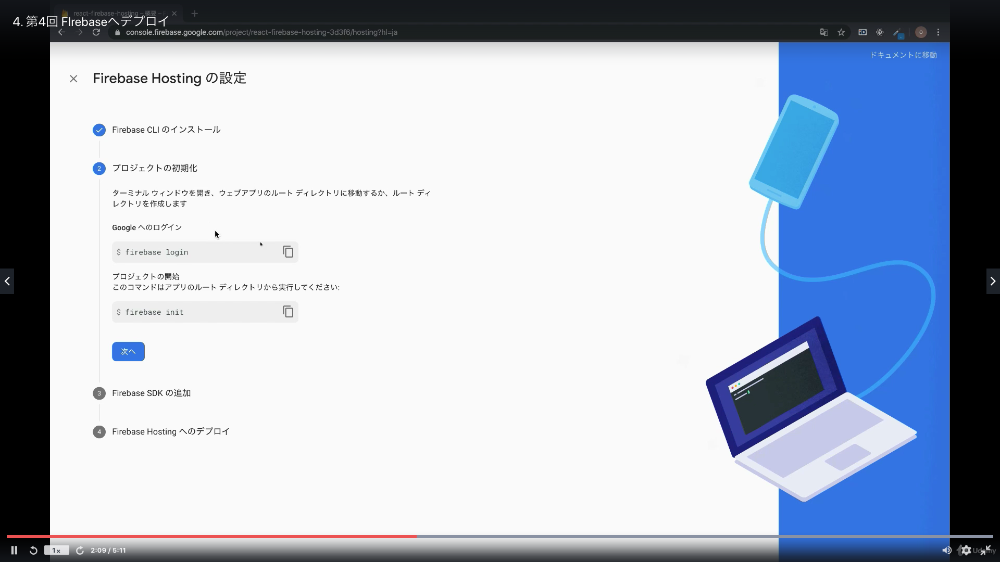
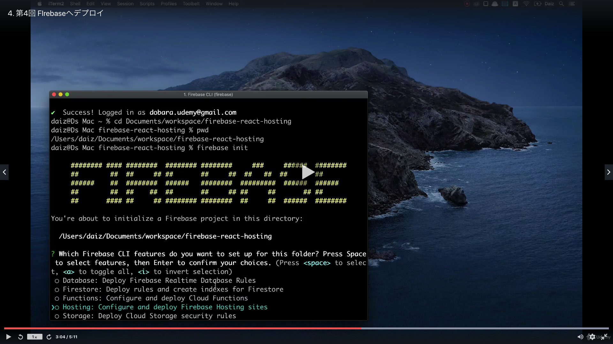
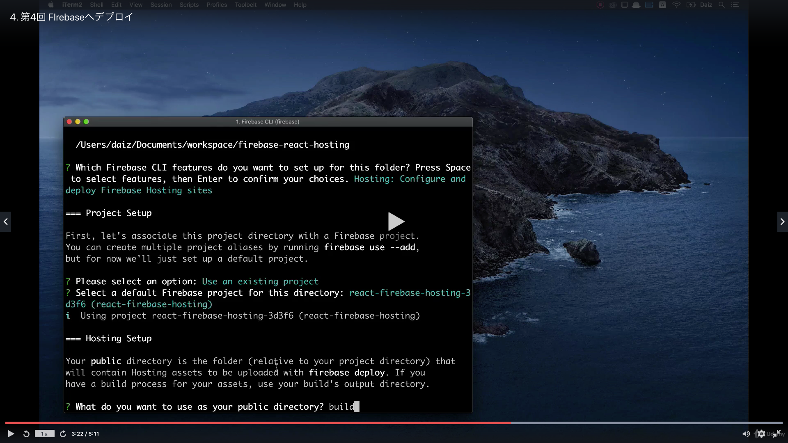
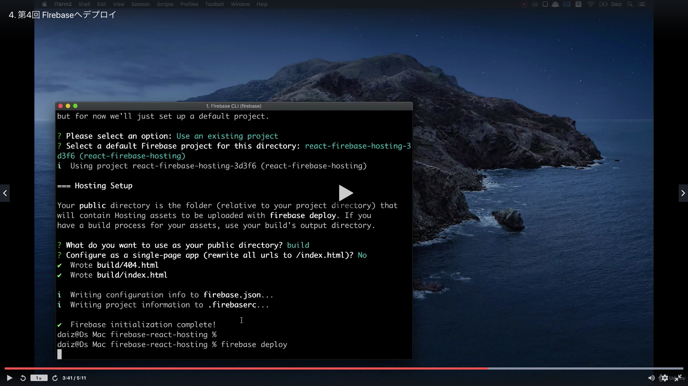
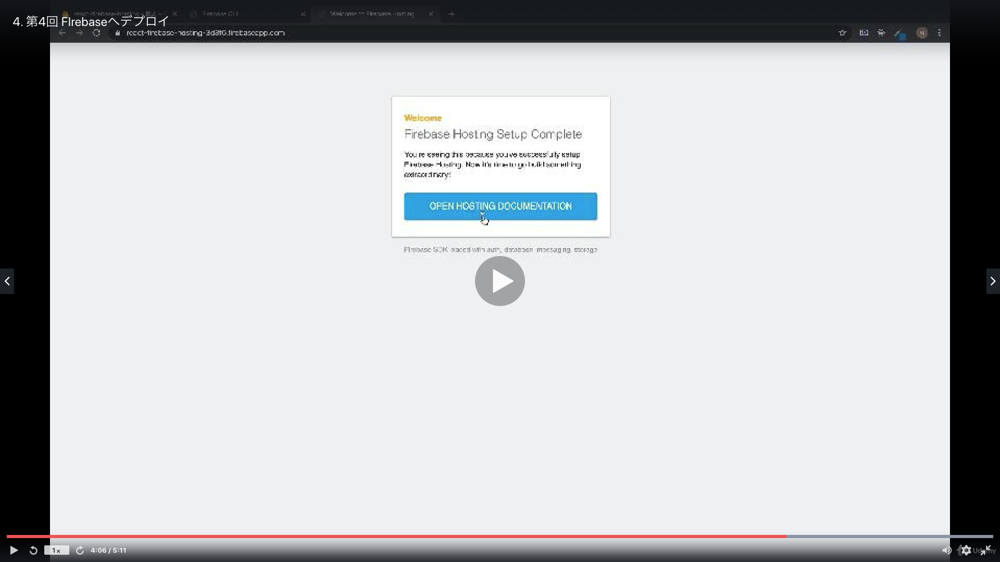
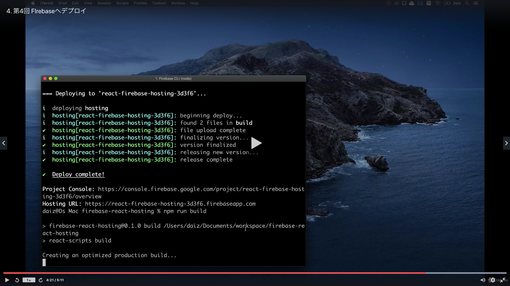

# Section02: Firebase Hosting を学ぶ

<a id = "contents">

# Contents
* [Flow](#flow)
* [Hosting](#Hosting)

### Pickup
* 


<a id = "flow">

## Flow
* 

* commands
  ```
  npm install react-app
  npm init react-app firebase-react-hosting-02
  cd firebase-react-hosting-02
  npm run start
  ```

* commands
  ```
  npm install expo
  npm install expo-cli
  expo init firebase-react-hosting (expo-template-blank)
  ```
  ```
  cd firebase-react-hosting
  npm install expo-cli
  expo start
  ```
  * Delete .git file (then you can push folder)
  ```
  ls -a
  rm -rf .git
  ```

### [Return to Contents](#contents)


<a id = "Hosting">

## Hosting
* 
* 
* 
* 
* 
* 
* 
* 

* commands
  ```
  cd firebase-react-hosting
  npm install firebase-tools
  //npm install firebase-functions
  firebase login
  firebase init (directory - build)
  firebase deploy
  ```
  ```
  npm run build
  firebase deploy
  firebase serve
  ```

### [Return to Contents](#contents)