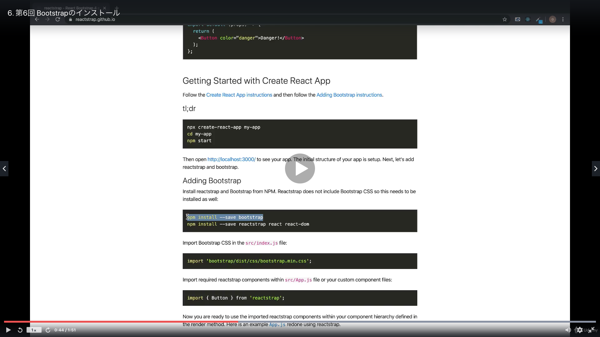

# Section03: Todoリストの作成

<a id = "contents">

# Contents
* [Flow](#flow)
* [BootStrap](#BootStrap)

### Pickup
* [Array.prototype.splice()](https://developer.mozilla.org/ja/docs/Web/JavaScript/Reference/Global_Objects/Array/splice)


<a id = "flow">

## Flow
* 

* commands

### [Return to Contents](#contents)


<a id = "BootStrap">

## BootStrap
* 

* commands
  ```
  npm install --save bootstrap
  npm install --save react react-dom
  ```
  ```
  npm run start
  ```

### [Return to Contents](#contents)